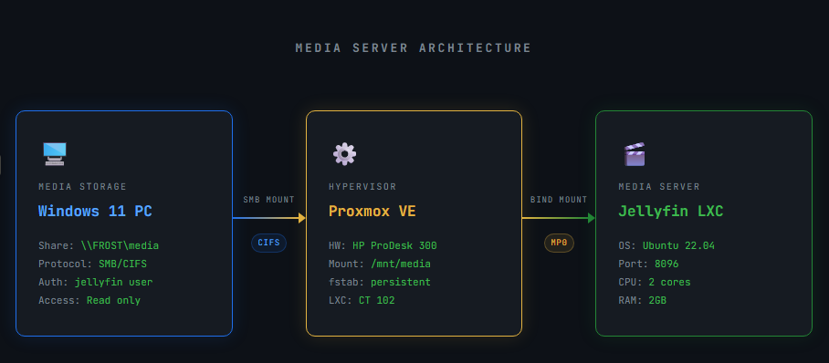

# Homelab Media Server

## Overview
This project documents the setup of a self-hosted media server using Jellyfin
on a Proxmox homelab. Media is stored on a Windows 11 machine and accessed
by Jellyfin over a network share.

## Environment
- **Hypervisor:** Proxmox VE
- **Hardware:** HP ProDesk 300
- **Jellyfin Host:** LXC Container (Ubuntu 22.04)
- **Media Storage:** Windows 11 PC (SMB share)
- **Media Player:** Jellyfin

## Architecture
- Windows 11 PC hosts media files via SMB share
- Proxmox mounts the SMB share on the host
- Share is bind-mounted into the Jellyfin LXC container
- Jellyfin serves media over the local network

## Setup Summary

### SMB Share (Windows 11)
- Created a dedicated local user with read-only access
- Shared media folder over SMB
- Restricted access to the jellyfin user only

### Proxmox LXC Container
- Ubuntu 22.04 LXC container (2 cores, 2GB RAM, 8GB disk)
- Unprivileged container with nesting enabled

### Mounting the Share
- Installed cifs-utils on Proxmox host
- Mounted SMB share at /mnt/media
- Added to /etc/fstab for persistence
- Bind-mounted into LXC container via /etc/pve/lxc/102.conf

### Jellyfin
- Installed via official repository
- Media library pointed to /mnt/media
- Metadata pulled from TheMovieDb

## Future Improvements
- Set up remote access via VPN
- Add hardware transcoding
- Migrate media storage to a NAS
- Set up automatic backups
